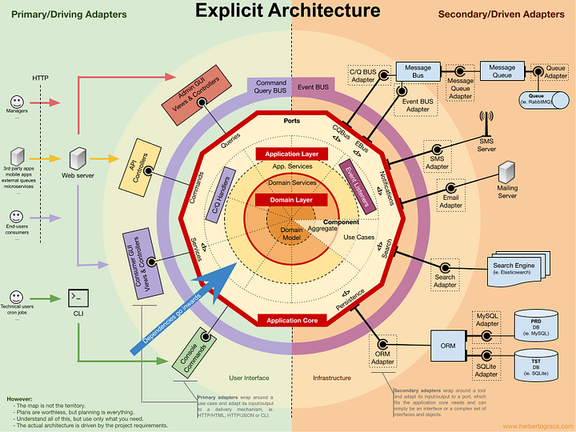

# golang-hexagonal-architecture

A ideia deste repositório é praticar os conceitos da Hexagonal Architecture de um modo divertido e prático!

## Pré-Requisitos

- GOLANG 1.16;
- [Composer](https://getcomposer.org);
- [Docker](https://www.docker.com);

## Subir o container

* Para subir o container, executar o seguinte comando `docker compose up -d`

## Acessar o container

* Para acessar o container, executar o seguinte comando `docker exec -it app-product bash`

## Instalando dependências

* Para instalar todas as dependencias, executar o seguinte comando (no container)  `go get -d -v ./...` 

## Executar os Tests

* Para rodar todos os tests, executar o seguinte comando (no container) `go test ./...`

## Para subir o api

* Executar o seguinte comando (no container) `go run main.go http`

## Para executar o CLI

* Executar o seguinte comando (no container) `go run main.go product-cli --action=create --price=10.00 --product=teste cli`

